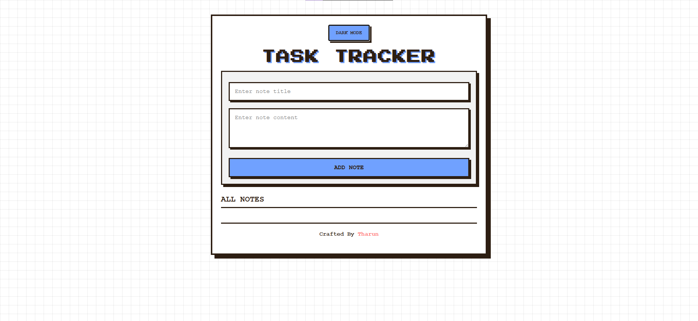

# MERN CRUD Application

A full-stack CRUD (Create, Read, Update, Delete) application built using the MERN stack. 
The project allows users to manage records through a responsive interface with real-time database operations.

## Screenshot

## Live Demo

🔗 https://mern-crud-web.vercel.app

## Tech Stack

### Frontend
- React.js
- CSS
- Axios

### Backend
- Node.js
- Express.js

### Database
- MongoDB
- Mongoose

## Learning Outcomes

- Building REST APIs with Express.js
- Connecting MongoDB using Mongoose
- Managing application state in React
- Performing CRUD operations
- Frontend and backend integration
- Environment variable management

